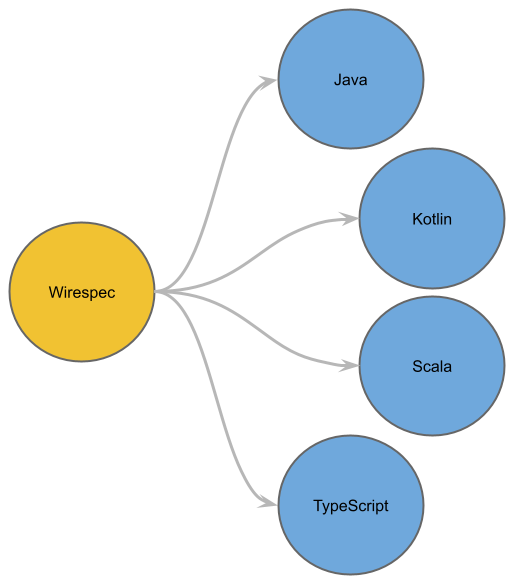
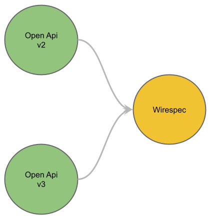
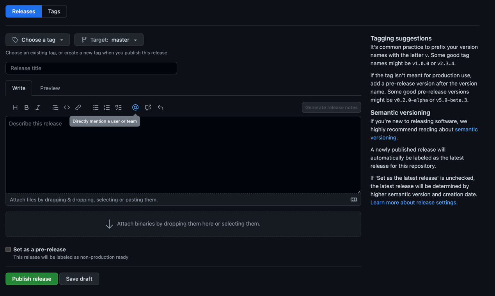

[](https://mvnrepository.com/artifact/community.flock.wirespec.compiler/core-jvm)
[](LICENSE)


# Wirespec

Readable contracts and typesafe wires made easy

## Introduction

Wirespec is a typesafe language to specify endpoints and data transfer models that are exchanged between services.
These models and endpoints can then be compiled into bindings for a specific language (TypeScript, Java, Kotlin, Scala).



Wirespec can read and convert OpenApiSpecification (OAS) files.



## Syntax

Wirespec knows four definitions: `refined`, `enum`, `type`, `endpoint`.

### Refined
```wirespec
refined DEFINITION /REGEX/g
```

### Enum
```wirespec
enum DEFINITION {
    ENTRY, ENTRY, ...
}
```

### Type
```wirespec
type DEFINITION {
    IDENTIFIER: REFERENCE
}
```

### Union
```wirespec
union DEFINITION {
    ENTRY, ENTRY, ...
}
```

### Endpoint
```wirespec
endpoint DEFINITION METHOD [INPUT_REFERENCE] PATH [? QUERY] [# HEADER] -> {
    STATUS -> REFERENCE
}
```

## Example

`todo.ws`

```wirespec
refined UUID /^[0-9a-fA-F]{8}\b-[0-9a-fA-F]{4}\b-[0-9a-fA-F]{4}\b-[0-9a-fA-F]{4}\b-[0-9a-fA-F]{12}$/g

type Todo {
    id: UUID,
    name: String,
    done: Boolean
}

type TodoInput {
    name: String,
    done: Boolean
}

type Error {
    code: String,
    description: String
}

endpoint GetTodoById GET /todos/{ id: UUID } -> {
    200 -> Todo[]
    404 -> Error
}

endpoint GetTodos GET /todos?{ done: Boolean? }#{ limit: Integer, offset: Integer } -> {    
    200 -> Todo[]
    404 -> Error
}

endpoint CreateTodo POST TodoInput /todos -> {
    200 -> Todo
    404 -> Error
}

endpoint UpdateTodo PUT TodoInput /todos/{id:UUID} -> {
    200 -> Todo
    404 -> Error
}

endpoint DeleteTodo DELETE /todos/{id:UUID} -> {
    200 -> Todo
    404 -> Error
}
```

Other examples can be found [here](examples/README.md)

## Usage

Wirespec files can be compiled into language specific binding by using the cli

```shell
wirespec compile ./todo.ws -o ./tmp -l Kotlin
```

## Plugins

* Maven
* Gradle

## Extentions

* IntelliJ IDEA
* Visual Studio Code

## Integration
Wirespec offers integration libraries with differ libraries.

* [Jackson](src/integration/jackson)

# CLI

## Install

### Linux

```shell
curl -L https://github.com/flock-community/wirespec/releases/latest/download/linuxX64.kexe -o wirespec
chmod +x wirespec
sudo mv ./wirespec /usr/local/bin/wirespec
```

### macOS

```shell
curl -L https://github.com/flock-community/wirespec/releases/latest/download/macosX64.kexe -o wirespec
chmod +x wirespec
sudo mv ./wirespec /usr/local/bin/wirespec
```

### macOS Arm

```shell
curl -L https://github.com/flock-community/wirespec/releases/latest/download/macosArm64.kexe -o wirespec
chmod +x wirespec
sudo mv ./wirespec /usr/local/bin/wirespec
```

## Use

```shell
wirespec -h
```

```
Usage: wirespec options_list
Subcommands: 
    compile - Compile Wirespec
    convert - Convert from OpenAPI

Arguments: 
    input -> Input file { String }

Options: 
    --output, -o -> Output directory { String }
    --debug, -d [false] -> Debug mode 
    --languages, -l -> Language type { Value should be one of [Java, Kotlin, Scala, TypeScript, Wirespec] }
    --packageName, -p [community.flock.wirespec.generated] -> Package name { String }
    --strict, -s [false] -> Strict mode 
    --help, -h -> Usage info 
```

```shell
wirespec convert -h
```

```
Usage: wirespec convert options_list
Arguments: 
    input -> Input file { String }
    format -> Input format { Value should be one of [openapiv2, openapiv3] }
```

# Plugins

Other examples can be found [here](examples/README.md)

# Quick Start with this repository

## Dependencies

* JDK 17
* Node 16
* Docker

Clone this repository and run (n *nix systems):

```shell
make all
```

to compile the project and test the Wirespec compiler with definitions found in `types`. Locate the result
in `types/out`

# Releases

A release can be made using GitHub the UI.
Go to https://github.com/flock-community/wirespec/releases/new



- Create a tag according to the following pattern `v*.*.*`
- Enter the release title `Release *.*.*`
- Click `Publish release`
