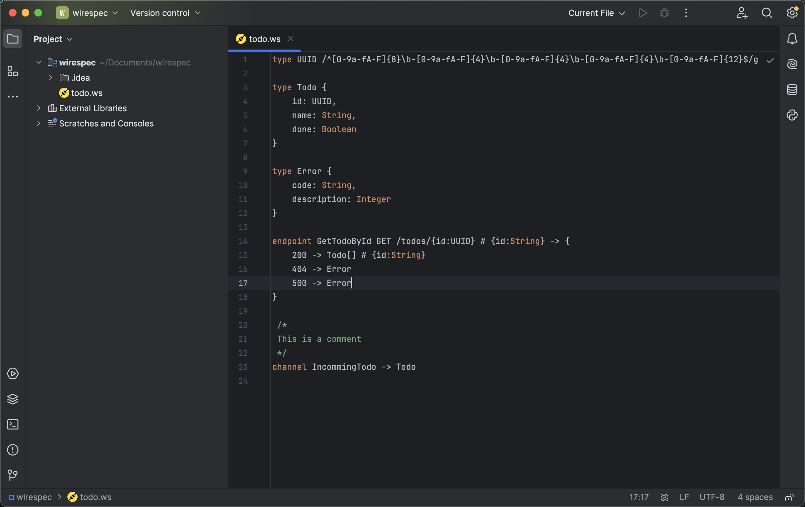
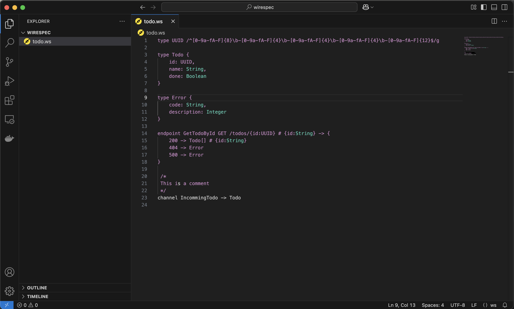

# Integrated Development Environment (IDE)

Wirespec supports two IDEs: IntelliJ IDEA and VS Code.

## IntelliJ IDEA

### Installation

- Install from the JetBrains Marketplace.

### Features

- Syntax highlighting
- Compile error detection
- Refactoring options
- Find usages functionality

## VS Code

### Installation

- Install from the Visual Studio Code Marketplace.

### Features

- Syntax highlighting
- Compile error detection

