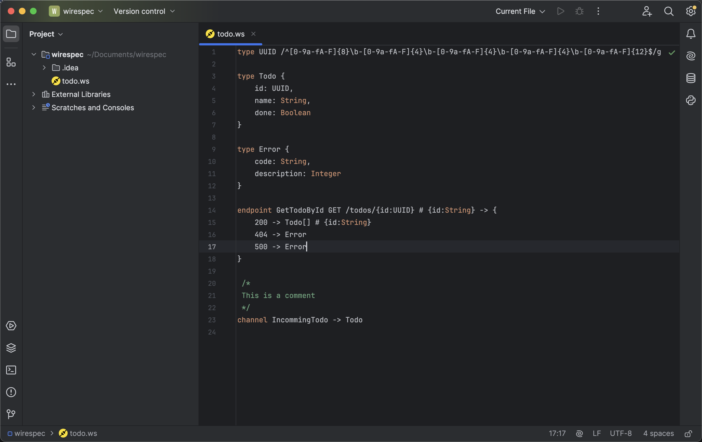
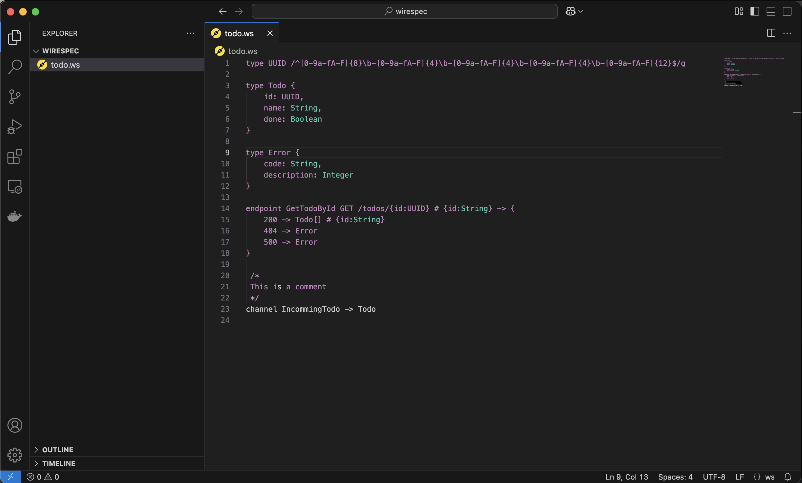

# Integrated Development Environment (IDE)

Wirespec supports two IDEs: IntelliJ IDEA and VS Code.

## IntelliJ IDEA

### Installation

- Install from the JetBrains Marketplace.

### Features

- Syntax highlighting
- Compile error detection
- Refactoring options
- Find usages functionality

## VS Code

### Installation

- Install from the Visual Studio Code Marketplace.

### Features

- Syntax highlighting
- Compile error detection
- Go-to-definition for user-defined types
- Rename Symbol (F2) for user-defined types

## Under the hood

Both IDEs share a single editor-agnostic [Language Server](./lsp.md) that does the parsing, validation, and refactoring. The same server can be driven from any LSP-capable editor or from a coding agent — see the [Language Server page](./lsp.md) for details.
